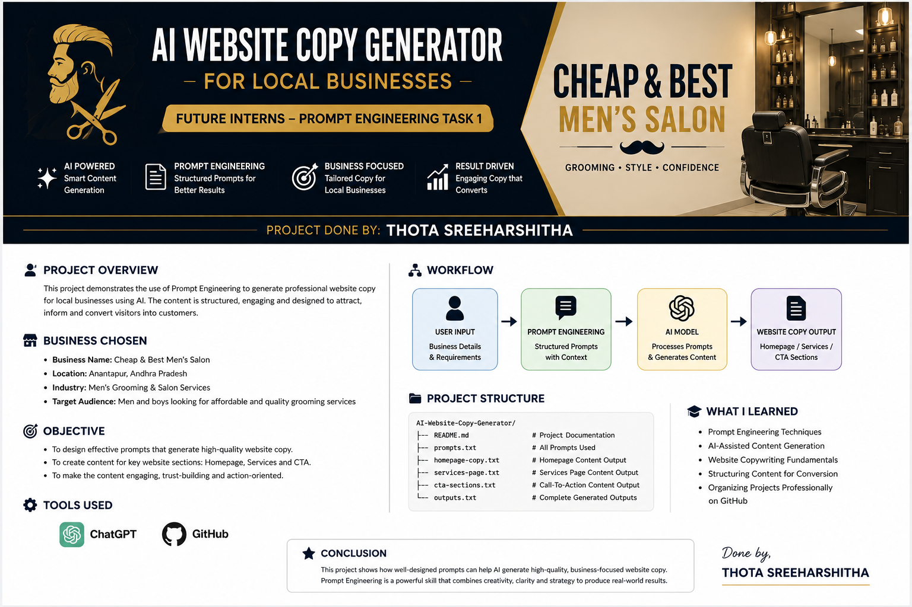

  

# AI Website Copy Generator for Local Businesses using Prompt Engineering

### Future Interns – Prompt Engineering Task 1

**Project Done By: Thota Sreeharshitha**  
**Project ID: FUTURE_PE_01**

---

## Project Overview

This project demonstrates the practical application of Prompt Engineering to generate professional website copy for local businesses using Artificial Intelligence. The goal of this project is to design effective prompts that enable AI systems to create structured, engaging, and conversion-focused website content.

For this project, a local grooming and beauty business, Cheap & Best Men's Salon, was selected as the target business model. Through carefully engineered prompts, AI-generated content was created for essential website sections including the homepage, services page, and call-to-action sections.

---

## Objective

- Demonstrate Prompt Engineering skills through practical implementation.
- Generate professional website content using Artificial Intelligence.
- Create reusable prompts that can be adapted for different local businesses.
- Improve content creation efficiency while maintaining quality and consistency.
- Showcase the impact of prompt design on AI-generated outputs.

---

## Business Profile

### Business Name
Cheap & Best Men's Salon

### Location
Anantapur, Andhra Pradesh

### Industry
Men's Grooming and Beauty Services

### Target Audience

- Students
- Working Professionals
- Job Seekers
- Grooms and Wedding Clients

---

## Tools Used

- ChatGPT
- Prompt Engineering
- GitHub
- Markdown Documentation

---

## Prompt Engineering Methodology

Prompts were designed using:
- Business Name
- Business Category
- Location
- Target Audience
- Desired Tone
- Output Structure

---

# Prompt 1 – Homepage Content Generation

## Prompt

Create homepage content for a men's grooming salon named Cheap & Best Men's Salon located in Anantapur.

Include:
- Headline
- Sub-headline
- Introduction Paragraph

Tone: Professional, welcoming, and trustworthy.

## Generated Output

### Headline
Enhance Your Style with Confidence

### Sub-Headline
Affordable and professional grooming services designed to help you look sharp, feel confident, and make a lasting impression.

### Introduction
Cheap & Best Men's Salon offers premium grooming services at affordable prices. Our experienced professionals specialize in haircuts, beard styling, skincare treatments, and grooming solutions tailored to modern men.

---

# Prompt 2 – Services Page Generation

## Prompt

Create a services page for Cheap & Best Men's Salon.

Include:
- Hair Styling
- Facial Treatments
- Groom Makeup

Tone: Professional and customer-focused.

## Generated Output

### Hair Styling
Professional haircuts and styling solutions tailored to individual preferences.

### Facial Treatments
Customized skincare treatments designed to cleanse, refresh, and rejuvenate the skin.

### Groom Makeup
Complete grooming and makeup packages for weddings and special occasions.

# Prompt 3 – Call-To-Action Generation

## Prompt

Generate three call-to-action sections for a men's grooming salon.

Tone: Persuasive and professional.

## Generated Output

### Book Your Appointment Today
Schedule your visit and experience premium grooming services.

### Limited Weekend Slots Available
Reserve your preferred time slot today.

### Visit Cheap & Best Men's Salon
Experience quality grooming services at affordable prices.

### Visit Cheap & Best Men's Salon
Experience quality grooming services at affordable prices.

---

## Repository Structure

- README.md
- banner.png
- prompts.txt
- homepage-copy.txt
- services-page.txt
- cta-sections.txt
- outputs.txt

---

## Key Learnings

- Prompt Design and Optimization
- AI-Assisted Content Generation
...

## Conclusion

This project demonstrates how Prompt Engineering can be leveraged to generate professional website content for local businesses.

### Author
**Thota Sreeharshitha**
